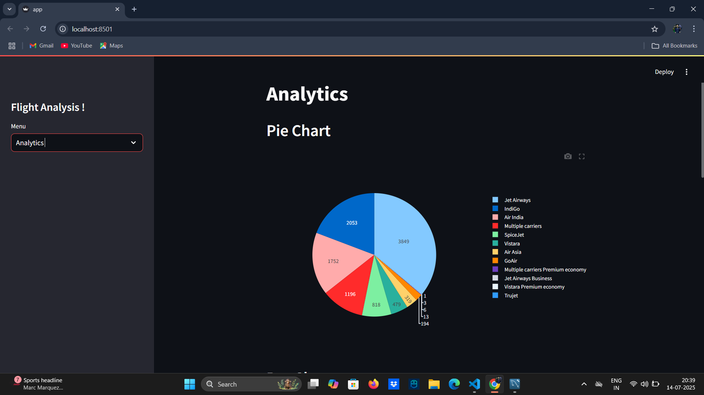

# ✈️ Flight Data Analysis Dashboard

A full-stack data analysis project that connects **SQL** with **Python** and builds an interactive **Streamlit** dashboard for exploring cleaned flight data.

 <!-- Replace with your image path -->

---

## 📊 Project Overview

This project performs an in-depth analysis of flight data, connecting SQL databases to Python for data retrieval and transformation. The final output is visualized in an intuitive and interactive **Streamlit web application**.

### 🚀 Key Features
- SQL integration using `mysql-connector-python` / `SQLAlchemy`
- Pandas for EDA and data preprocessing
- Streamlit app for interactive dashboard
- Insights on:
  - Most frequent airlines and routes
  - Delay patterns
  - Flight frequency over time
  - Price vs time analysis

---

## 🛠️ Tech Stack

| Tool         | Purpose                    |
|--------------|----------------------------|
| MySQL        | Storing and querying data  |
| Python       | Data processing            |
| Pandas       | Data manipulation          |
| Streamlit    | Web app/dashboard          |
| Matplotlib & Seaborn | Data visualization |

---

## 🧩 Database Connection

We use the `mysql-connector-python` module to connect to the MySQL database. Below is a snippet:

```python
import mysql.connector
import pandas as pd

# Establish connection
conn = mysql.connector.connect(
    host='localhost',
    user='root',
    password='your_password',
    database='flights_db'
)

# Fetch data
query = "SELECT * FROM flights_cleaned;"
df = pd.read_sql(query, conn)
Make sure your MySQL server is running and replace credentials accordingly.```

💻 How to Run the Project
Clone the repo

bash
Copy
Edit
git clone https://github.com/yourusername/flight-data-streamlit.git
cd flight-data-streamlit
Install dependencies

bash
Copy
Edit
pip install -r requirements.txt
Start MySQL server and ensure your flights_cleaned table is imported.

Run the Streamlit app

bash
Copy
Edit
streamlit run app.py``
